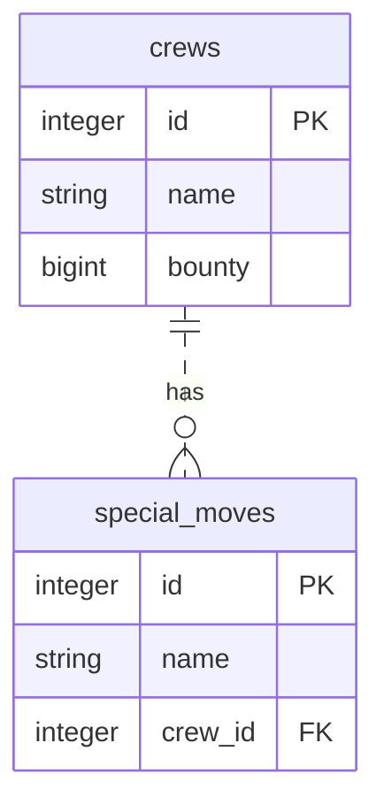
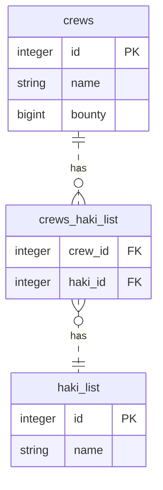
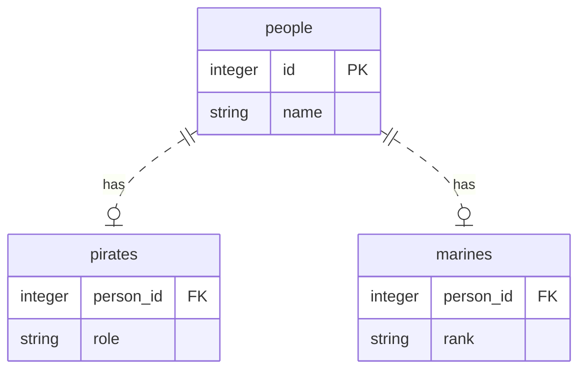

# How to Use

```
$ docker-compose run --rm dev bash
$ deno test --allow-net --allow-read
```

## DB Console

```
$ docker-compose run --rm db bash
$ psql -h db -U postgres
```

## ER Diagram

### Mapping Relationships





### Inheritance


